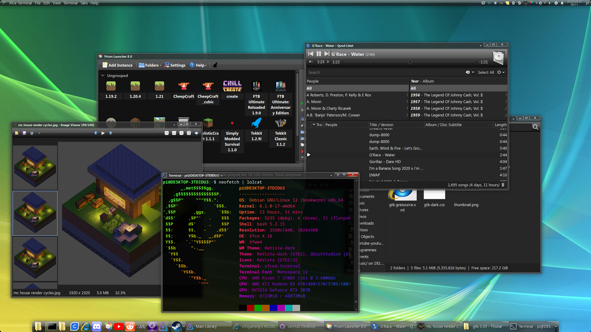
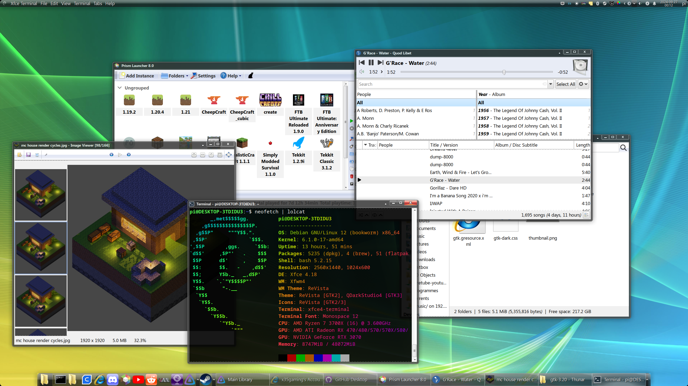

# ReVista
ReVista theme -  Windows Vista theme for GTK / XFCE

# What's included in this theme?
- A light and dark vista-esque GTK2/3/4 theme
- XFWM4 theme
- Dotfiles for libadwaita and optional styling
- An animated wallpaper using electron, vista IMG36 wallpaper lively "ribbons" overlaid
- A script to switch between light and dark modes (`Scripts/lightdark.sh`)

# Installation Instructions
- Copy the contents of `Themes` to `/usr/share/themes`
- Copy the contents of `Icons` to `/usr/share/icons`
- (optional) Copy `Scripts/lightdark.sh` (or `Scripts/lightdark-libadwaita.sh` when using dotfiles)  to `/usr/local/bin/lightdark`
- (optional) Copy the contents of `configs` to `~/.local/config/`
- (optional) Copy `Wallpaper` to `/wallpaper` and add `~/electron-wallpaper` to startup
- (optional) Download `Segoe UI` font family, and set it as your UI font